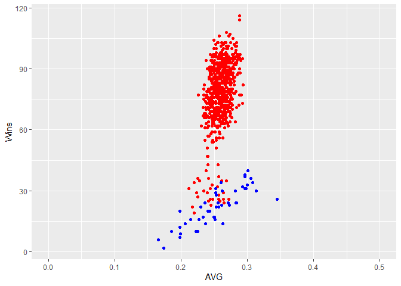
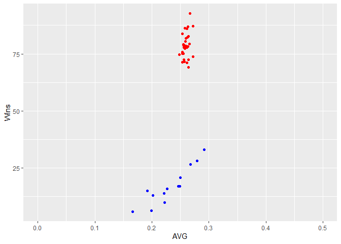
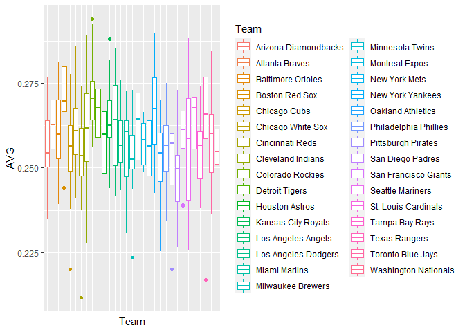
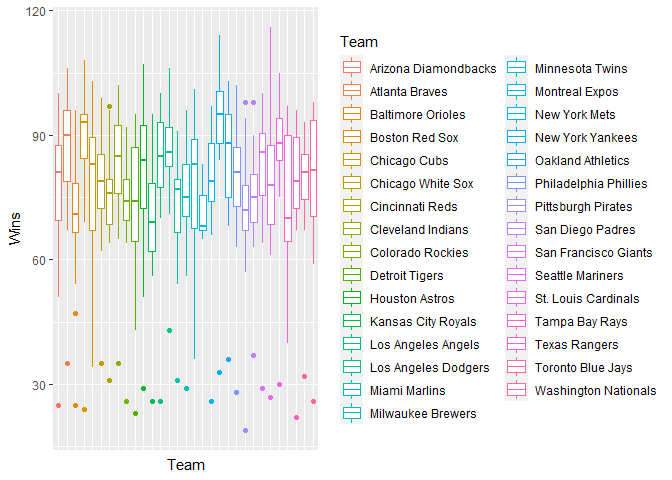
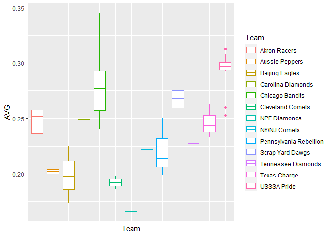
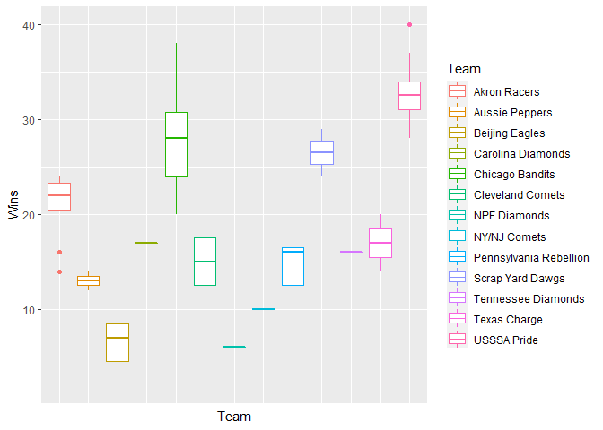

```{r setup, include=FALSE}
knitr::opts_chunk$set(echo = TRUE)
library(tidyverse)
library(dplyr)
```

```{r}

mlb <- read.csv("https://raw.githubusercontent.com/MaggieLangheim/MLB-NPF-Analysis/main/mlb%202019%20team%20data.csv", na.strings = c("", "NA"))

npf <- read.csv("https://raw.githubusercontent.com/MaggieLangheim/MLB-NPF-Analysis/main/npf%20team%20stats.csv")

```


### Let's start off tidying the data set by only selecting the variables we need. This includes team names, games played, wins, losses, at bats, hits, and batting average.

```{r}
mlb2 <- subset(mlb, yearID >= 1998) %>%
  select(yearID, lgID, name, G, W, L, AB, H) %>%
  relocate("Team" = name, .before = lgID) %>%
  rename("Year" = yearID, "League" = lgID, "Games" = G, "Wins" = W, "Losses" = L) 

npf2 <- npf %>%
  rename("Year" = ï..Year, "Wins" = W, "Losses" = L) %>%
  select(Year, Team, Wins, Losses, G, AB, H, AVG) %>%
  relocate("Games" = G, .after = Team)
```


### Next, we need to transform the data to make sure it is uniform and ready to be analylized. This step includes matching up data for teams that have had name changes since 1998 and creating a batting average column for the MLB data. 
### Also, group the data together by team as a separate object to compare the franchises in addition to looking at individual teams. It is important to note that for analyzing franchises, MLB teams had 3x as many games as NPF teams in a season.

```{r}
mlb2 <- mlb2 %>%
  mutate(AVG = H / AB) %>%
  mutate(Team = str_replace(Team, "Anaheim Angels", "Los Angeles Angels")) %>%
  mutate(Team = str_replace(Team, "Los Angeles Angels of Anaheim", "Los Angeles Angels")) %>%
  mutate(Team = str_replace(Team, "Florida Marlins", "Miami Marlins")) %>%
  mutate(Team = str_replace(Team, "Tampa Bay Devil Rays", "Tampa Bay Rays"))

mlb3 <- mlb2 %>%
  group_by(Team) %>%
  summarise(across(c(Games, Wins, AVG), mean))
  ##mutate(Wins = Wins/3, Games = Games/3)
  ##3 mlb observations (games) per every one npf observation

npf3 <- npf2 %>%
  group_by(Team) %>%
  summarise(across(c(Games, Wins, AVG), mean))

```


### The next step is to visualize the data which we'll do by creating two separate scatter plots for wins and batting average. The first scatter shows the relationship per season by team with each dot representing a different season. The second scatter plot is similar to the first, but there is only one point per franchise as it is showing the averages over time for each franchise. MLB points are displayed in read and the NPF in blue.

```{r}
ggplot(mlb2, 
       aes(x = AVG, y = Wins)) +
  geom_point(color = 'red') +
  geom_point(data = npf2, color = 'blue') +
  xlim(0, .5)
```
<!-- -->

#### There are a few things that are noticeable off the bat. Baseball has many more season observations than softball, and softball plays almost three times less games per season than baseball. It is not too important that there are many more baseball observations than softball because the trend for both data sets is similar.

#### Also, there is a greater range of batting averages in the NPF data. All the averages for MLB are between .200 and .300, but NPF averages range from approximately .150 to .350.

#### For both leagues, there is a positive linear relationship between batting average and wins in a season, which means the higher a team’s batting average is, the more wins they will have.

```{r}
ggplot(mlb3, 
       aes(x = AVG, y = Wins)) +
  geom_point(color = 'red') +
  geom_point(data = npf3, color = 'blue') +
  xlim(0, .5)
```
<!-- -->

#### Looking at the second scatter plot comparing batting average to wins over time, there are really patterns that do not exist in the season-to-season data. 

#### The NPF data is still has a positive linear relationship indicating that the higher the batting average is, the more wins they will have over time, but the MLB data no longer looks linear. This may indicate that in Major League Baseball there is not a relationship between the total number of franchise wins and batting average over time. 


### Also, to visualize the data there are four different box plots, two for MLB data and two for NPF data. It is important to note that there are four NPF teams that have only ever played one season, so the box plot is not applicable to those franchises.

```{r}
ggplot(mlb2,
       aes(x = Team, y = AVG, color = Team)) +
  geom_boxplot() +
  theme(axis.text.x = element_blank(),
        axis.ticks.x = element_blank())
```
<!-- -->

```{r}
ggplot(mlb2,
       aes(x = Team, y = Wins, color = Team)) +
  geom_boxplot() +
  theme(axis.text.x = element_blank(),
        axis.ticks.x = element_blank())
```
<!-- -->

```{r}
ggplot(npf2,
       aes(x = Team, y = AVG, color = Team)) +
  geom_boxplot() +
  theme(axis.text.x = element_blank(),
        axis.ticks.x = element_blank())
```
<!-- -->

```{r}
ggplot(npf2,
       aes(x = Team, y = Wins, color = Team)) +
  geom_boxplot() +
  theme(axis.text.x = element_blank(),
        axis.ticks.x = element_blank())
```
<!-- -->

#### The MLB plots which support the thinking that a higher batting average leads to more wins. 

#### But for the NPF, there are points on the boxplot that suggest there are factors outside of batting average that contribute to wins. This result makes sense because there are other things that go into a winning team, like pitching, defense, and other aspects of hitting.


### Lastly, we're going to model the data by using an analysis of variance, or ANOVA, to determine if the relationship between wins and batting average within the MLB and NPF is statistically significant. This includes four separate ANOVAs, two for MLB data and two for NPF data. For both MLB and NPF data, there is one ANOVA to analyze the statistics per season and one to analyze the statistics over time.

```{r}
mlb_model1 <- aov(Wins ~ AVG, data = mlb2)
summary(mlb_model1)

npf_model1 <- aov(Wins ~ AVG, data = npf2)
summary(npf_model1)

mlb_model2 <- aov(Wins ~ AVG, data = mlb3)
summary(mlb_model2)

npf_model2 <- aov(Wins ~ AVG, data = npf3)
summary(npf_model2)
```

#### The model includes p-values, multiple R square, and coefficients which are all beneficial to describing the effect stolen bases have on total wins. 

#### To start off, look at the p-values which indicate whether or not the relationship is caused by something other than chance, and the typical cutoff is 0.05. The only model that is not significant is wins based on average for the franchise MLB data. An explanation for this could be the fact that the MLB data does have more observations than the NPF data, so the averages for the NPF are skewed in comparison to the MLB.
