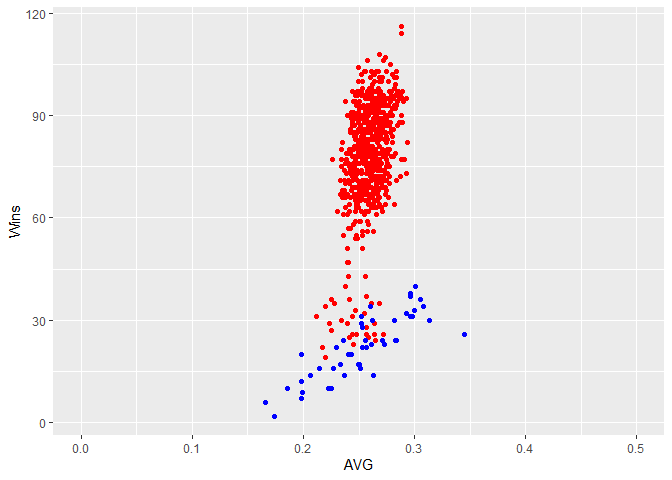
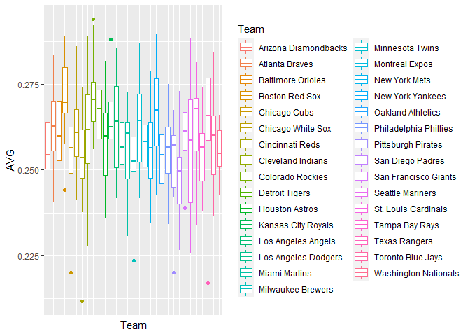
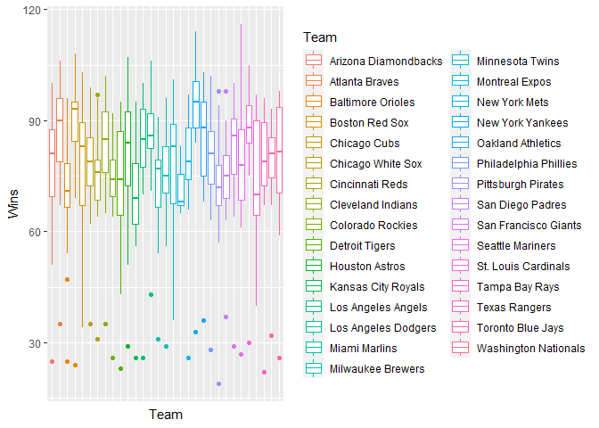
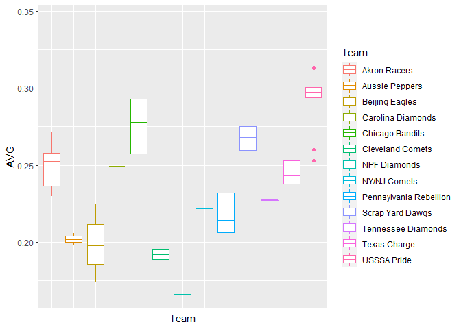

Final Project - Baseball Analysis
================
MAL
3/16/2021

\#\#Before beginning, this analysis utilizes the following packages:
tidy verse

\#\#\#Import

``` r
## crtl + atl + i

mlb <- read.csv("https://raw.githubusercontent.com/MaggieLangheim/MLB-NPF-Analysis/main/mlb%202019%20team%20data.csv", na.strings = c("", "NA"))

npf <- read.csv("https://raw.githubusercontent.com/MaggieLangheim/MLB-NPF-Analysis/main/npf%20team%20stats.csv")
```

\#\#\#Tidy

``` r
mlb2 <- subset(mlb, yearID >= 1998) %>%
  select(yearID, lgID, name, G, W, L, AB, H) %>%
  relocate("Team" = name, .before = lgID) %>%
  rename("Year" = yearID, "League" = lgID, "Games" = G, "Wins" = W, "Losses" = L) 

npf2 <- npf %>%
  rename("Year" = ï..Year, "Wins" = W, "Losses" = L) %>%
  select(Year, Team, Wins, Losses, G, AB, H, AVG) %>%
  relocate("Games" = G, .after = Team)
  ##slice(-10)
  ##remove teams with only one season
```

\#\#\#Transform

``` r
mlb2 <- mlb2 %>%
  mutate(AVG = H / AB) %>%
  mutate(Team = str_replace(Team, "Anaheim Angels", "Los Angeles Angels")) %>%
  mutate(Team = str_replace(Team, "Los Angeles Angels of Anaheim", "Los Angeles Angels")) %>%
  mutate(Team = str_replace(Team, "Florida Marlins", "Miami Marlins")) %>%
  mutate(Team = str_replace(Team, "Tampa Bay Devil Rays", "Tampa Bay Rays"))

mlb3 <- mlb2 %>%
  group_by(Team) %>%
  summarise(across(c(Games, Wins, AVG), mean))
  ##mutate(Wins = Wins/3, Games = Games/3)
  ##3 mlb observations (games) per every one npf observation

npf3 <- npf2 %>%
  group_by(Team) %>%
  summarise(across(c(Games, Wins, AVG), mean))
```

\#\#\#Visualize

``` r
ggplot(mlb2, 
       aes(x = AVG, y = Wins)) +
  geom_point(color = 'red') +
  geom_point(data = npf2, color = 'blue') +
  xlim(0, .5)
```

<!-- -->

``` r
ggplot(mlb3, 
       aes(x = AVG, y = Wins)) +
  geom_point(color = 'red') +
  geom_point(data = npf3, color = 'blue') +
  xlim(0, .5)
```

<!-- -->

``` r
ggplot(mlb2,
       aes(x = Team, y = AVG, color = Team)) +
  geom_boxplot() +
  theme(axis.text.x = element_blank(),
        axis.ticks.x = element_blank())
```

<!-- -->

``` r
ggplot(mlb2,
       aes(x = Team, y = Wins, color = Team)) +
  geom_boxplot() +
  theme(axis.text.x = element_blank(),
        axis.ticks.x = element_blank())
```

<!-- -->

``` r
ggplot(npf2,
       aes(x = Team, y = AVG, color = Team)) +
  geom_boxplot() +
  theme(axis.text.x = element_blank(),
        axis.ticks.x = element_blank())
```

<!-- -->

``` r
ggplot(npf2,
       aes(x = Team, y = Wins, color = Team)) +
  geom_boxplot() +
  theme(axis.text.x = element_blank(),
        axis.ticks.x = element_blank())
```

<!-- -->

\#\#\#Model

``` r
mlb_model1 <- aov(Wins ~ AVG, data = mlb2)
summary(mlb_model1)
```

    ##              Df Sum Sq Mean Sq F value Pr(>F)    
    ## AVG           1  31075   31075   155.3 <2e-16 ***
    ## Residuals   688 137641     200                   
    ## ---
    ## Signif. codes:  0 '***' 0.001 '**' 0.01 '*' 0.05 '.' 0.1 ' ' 1

``` r
npf_model1 <- aov(Wins ~ AVG, data = npf2)
summary(npf_model1)
```

    ##             Df Sum Sq Mean Sq F value   Pr(>F)    
    ## AVG          1   2804  2803.5   102.7 3.43e-13 ***
    ## Residuals   45   1229    27.3                     
    ## ---
    ## Signif. codes:  0 '***' 0.001 '**' 0.01 '*' 0.05 '.' 0.1 ' ' 1

``` r
mlb_model2 <- aov(Wins ~ AVG, data = mlb3)
summary(mlb_model2)
```

    ##             Df Sum Sq Mean Sq F value Pr(>F)  
    ## AVG          1   89.3   89.34   3.115 0.0881 .
    ## Residuals   29  831.7   28.68                 
    ## ---
    ## Signif. codes:  0 '***' 0.001 '**' 0.01 '*' 0.05 '.' 0.1 ' ' 1

``` r
npf_model2 <- aov(Wins ~ AVG, data = npf3)
summary(npf_model2)
```

    ##             Df Sum Sq Mean Sq F value   Pr(>F)    
    ## AVG          1  669.1   669.1   56.12 1.21e-05 ***
    ## Residuals   11  131.1    11.9                     
    ## ---
    ## Signif. codes:  0 '***' 0.001 '**' 0.01 '*' 0.05 '.' 0.1 ' ' 1
